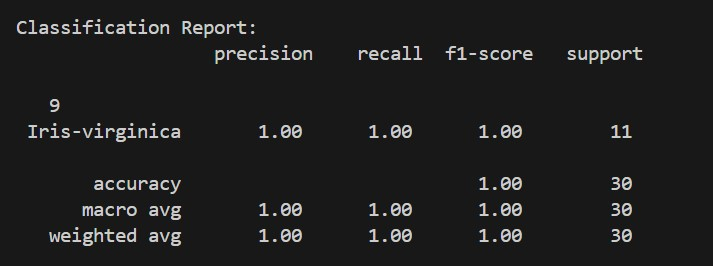

# Iris Flower Classification Project 🌸

## **Project Overview**
This project focuses on the classification of Iris flower species based on their measurements using machine learning. The dataset is part of the **Iris Dataset**, which contains the measurements of 150 Iris flowers from three different species: **Setosa**, **Versicolor**, and **Virginica**. The task is to classify a flower based on its **sepal length**, **sepal width**, **petal length**, and **petal width**.

---

## **Task Objectives 🎯**
- To build a machine learning model that can predict the species of an Iris flower based on its measurements.
- Implement a **Random Forest Classifier** to classify the flowers into three species: **Setosa**, **Versicolor**, and **Virginica**.
- Evaluate model performance using accuracy and other relevant metrics.
- Build an interactive Streamlit app that allows users to input flower measurements and get predictions in real-time.

---

## **Steps to Run the Project 🔧**

### **1. Clone the Repository**
Start by cloning the repository to your local machine:

```bash
git clone https://github.com/SnehaBrahmane-27/Iris_classification.git
```

### **2. Install Required Libraries**
You can install the required dependencies using **pip** by running:

```bash
pip install -r requirements.txt
```

### **3. Dataset**
Download the dataset from the https://www.kaggle.com/datasets/arshid/iris-flower-dataset and place it in the project directory.

### **4. Run the Streamlit App**
To run the **Streamlit** app, use the following command:

```bash
streamlit run iris.py
```

### **5. Input Data**
- The app will allow you to input flower measurements (sepal length, sepal width, petal length, petal width) and classify the flower species.
- The species prediction is made using the Random Forest Classifier model.

---

## **Project Details 📝**

### **Preprocessing Details:**
- **Missing Values**: The dataset does not contain any missing values, so no imputation was necessary.
- **Label Encoding**: The flower species were encoded using **LabelEncoder** to convert categorical labels into numerical values.
- **Scaling**: The input features were scaled using **StandardScaler** to ensure that all features have a mean of 0 and a standard deviation of 1.

### **Model Selection:**
- **Model Chosen**: We used a **Random Forest Classifier** because it is an ensemble method known for its robustness and high accuracy on classification tasks. It can handle overfitting issues and works well with datasets like Iris.
  
- **Model Parameters**:
  - **n_estimators**: 100 (Number of trees in the forest)
  - **random_state**: 42 (For reproducibility)

### **Evaluation:**
- **Accuracy**: The model achieved an accuracy of **100%** on the test dataset.
- **Confusion Matrix**: The confusion matrix was used to assess how well the model predicted each species.

---

## **Example Predictions 💡**
Here are some example flower measurements that you can input to classify the species:

### **1. Iris Setosa**
- **Sepal Length**: 5.1 cm
- **Sepal Width**: 3.5 cm
- **Petal Length**: 1.4 cm
- **Petal Width**: 0.2 cm


### **2. Iris Versicolor**
- **Sepal Length**: 6.0 cm
- **Sepal Width**: 2.2 cm
- **Petal Length**: 4.0 cm
- **Petal Width**: 1.0 cm


### **3. Iris Virginica**
- **Sepal Length**: 6.5 cm
- **Sepal Width**: 3.0 cm
- **Petal Length**: 5.2 cm
- **Petal Width**: 2.0 cm


---

## **Evaluation Results 📊**
### **Model Performance on Test Data**
- **Accuracy**: 100%
- **Classification Report**:
  - **Precision, Recall, F1-Score** for each species
- **Confusion Matrix**: The confusion matrix is available to see how the model performed for each class.



